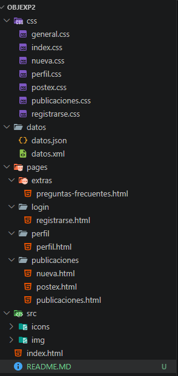

# Objex – Plataforma de Gestión de Objetos Extraviados
 
## Descripción
 
**Objex** es una plataforma web estática desarrollada para la comunidad universitaria de la
Universidad de las Fuerzas Armadas – ESPE. Permite a estudiantes, docentes y personal
administrativo reportar objetos perdidos o encontrados dentro del campus, contactar a otros
usuarios y gestionar sus publicaciones desde un perfil personal.
 
El proyecto aplica diseño **mobile-first** con CSS puro y el framework **Bootstrap 5**,
garantizando una experiencia de usuario correcta en teléfonos móviles, tabletas y computadoras
de escritorio.
---
 
## Objetivo
 
Diseñar e implementar una interfaz web responsiva que permita a la comunidad ESPE gestionar
objetos extraviados, aplicando el enfoque mobile-first, organización modular de estilos CSS
y componentes de Bootstrap 5.
 
---
 
## Tecnologías utilizadas
HTML5 
CSS
Bootstrap 
Font Awesome 
JavaScript
 
---

## Estructura de carpetas



## Páginas disponibles

Inicio de sesion
Registro
Publicaciones
Postex
Nueva publicacion
Perfil
Preguntas frecuentes

## Componentes Bootstrap utilizados

navbar
collapse
carousel
modal

## Instrucciones para ejecutar el proyecto
 
El proyecto es completamente estático
 
1. Descarga o clona el repositorio.
2. Abre el archivo `index.html` con cualquier navegador.
3. Navega entre las páginas usando los enlaces del menú.

## Archivos de datos
 
### datos.json
 
El archivo `datos.json` representa el modelo de datos de las publicaciones del sistema.
Define la estructura que usaría una API REST para proveer información dinámica a la interfaz.
Cada publicación incluye título, descripción, categoría, estado (`perdido` / `encontrado`),
ubicación dentro del campus, fecha, contacto, ruta de imagen y los datos del usuario que
la publicó (nombre, correo y nivel de confiabilidad).

```json
{
  "publicaciones": [
    {
      "id": 1,
      "titulo": "Mochila negra olvidada",
      "descripcion": "Mochila Totto negra con cierre dorado.",
      "categoria": "accessorio",
      "estado": "perdido",
      "ubicacion": "Aula del bloque A",
      "fecha": "2026-06-01",
      "contacto": "0991234567",
      "imagen": "src/img/mochila.jpeg",
      "usuario": {
        "id": 101,
        "nombre": "Yeiko Vélez",
        "correo": "yeiko@espe.edu.ec",
        "confiabilidad": 50
      }
    }
  ]
}
```
 
Cada campo del JSON se refleja directamente en la interfaz:
- `titulo` → encabezado de la tarjeta en publicaciones.html
- `estado` → badge `.perdido` o `.encontrado`
- `imagen` → `` dentro de la tarjeta
- `usuario.confiabilidad` → barra `<meter>` en perfil.html
---
 
### datos.xml
 
El archivo `datos.xml` representa la misma información en formato XML, útil para
interoperabilidad con sistemas que usen estándares SOAP o requieran exportación
estructurada de datos. Cada elemento `<publicacion>` contiene los mismos campos
que el JSON, organizados como etiquetas anidadas.
 
```xml
<?xml version="1.0" encoding="UTF-8"?>
<objex>
  <publicaciones>
    <publicacion id="1">
      <titulo>Mochila negra olvidada</titulo>
      <descripcion>Mochila Totto negra con cierre dorado.</descripcion>
      <categoria>accessorio</categoria>
      <estado>perdido</estado>
      <ubicacion>Aula del bloque A</ubicacion>
      <fecha>2026-06-01</fecha>
      <contacto>0991234567</contacto>
      <imagen>src/img/mochila.jpeg</imagen>
      <usuario id="101">
        <nombre>Yeiko Vélez</nombre>
        <correo>yeiko@espe.edu.ec</correo>
        <confiabilidad>50</confiabilidad>
      </usuario>
    </publicacion>
  </publicaciones>
</objex>
```
 
Ambos formatos son coherentes entre sí y con los datos visibles en la interfaz,
lo que facilita una futura migración a una versión dinámica del proyecto.
 
---
 
## Autor
 
**Yeiko Vélez**
Estudiante de Tecnologías de la Información
Universidad de las Fuerzas Armadas – ESPE
Correo: yevelez@espe.edu.ec
Año: 2026